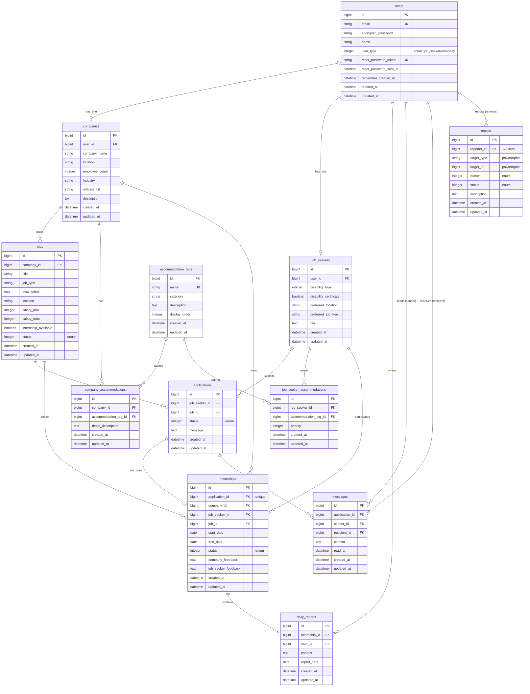

# ER図（ココロキャリア）

Rails のモデル定義と `db/schema.rb` を元に作成した、現在のデータベース構造の ER 図です。
Mermaid をサポートしているビューア（GitHub / VS Code の Markdown Preview Mermaid Support 拡張など）で表示できます。

## 全体図



## 関連のポイント

### 1. User を起点としたプロフィール分岐
- `users.user_type`（enum）で「求職者」か「企業」かを区別
- `User` は `Company` もしくは `JobSeeker` を `has_one` で持つ
- 求職者 / 企業のどちらになるかはサインアップ時に決まる

### 2. 応募 → インターン の流れ
```
JobSeeker  ─┐
            ├─► Application ─► Internship ─► DailyReport（毎日の日報）
Job        ─┘      │
                   └─► Message（応募スレッド上のやり取り）
```
- `applications` は `job_seeker_id + job_id` で一意（同じ求人に重複応募不可）
- `internships` は `application_id` が **unique**（1応募につき最大1インターン）
- `messages` は `application` に紐づき、`sender` / `recipient` の両方が `users` を参照

### 3. 配慮事項タグ（Accommodation）
- `AccommodationTag` を中間テーブルで企業・求職者それぞれに紐付け
  - `company_accommodations`: 企業が提供できる配慮
  - `job_seeker_accommodations`: 求職者が必要とする配慮（`priority` 付き）
- 同じ `company_id + accommodation_tag_id` / `job_seeker_id + accommodation_tag_id` の重複は不可

### 4. 通報（Report）はポリモーフィック
- `reports.target_type` + `target_id` で `Job` / `User` など複数のモデルを通報対象にできる
- `reporter_id` は `users` への FK

## 図の見方（Mermaid 記法）

| 記号 | 意味 |
|------|------|
| `\|\|--o\|` | 1 対 0..1 |
| `\|\|--o{` | 1 対 0..多 |
| `}o--o{` | 多 対 多 |
| `PK` | 主キー |
| `FK` | 外部キー |
| `UK` | ユニーク制約 |
